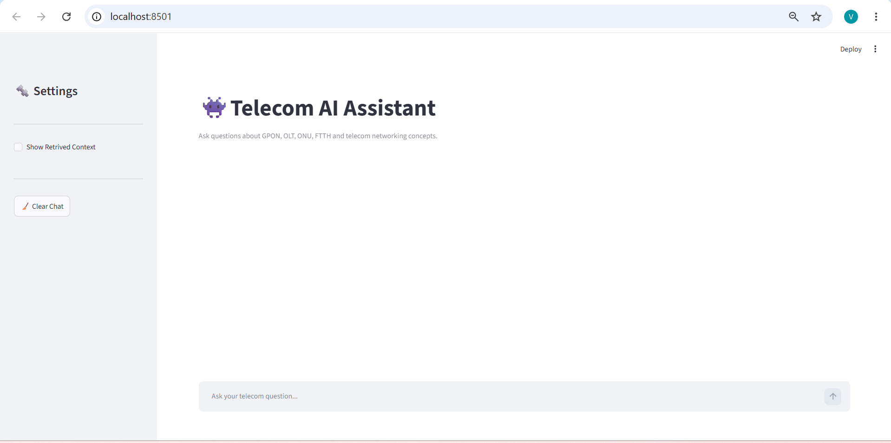
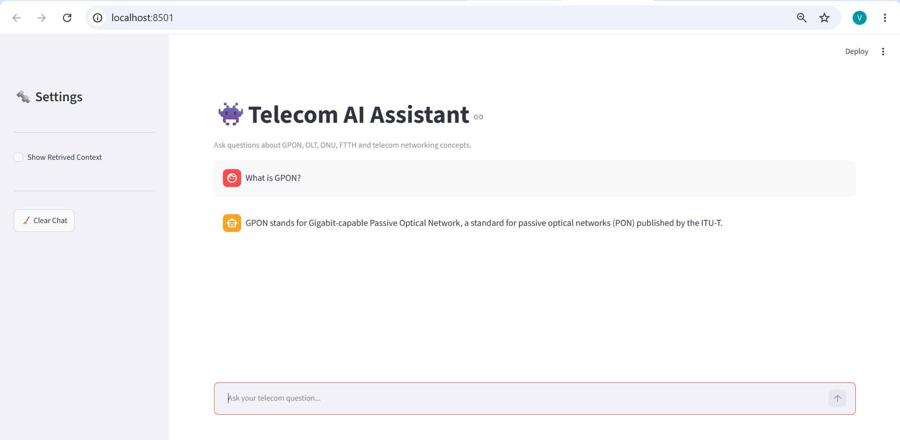
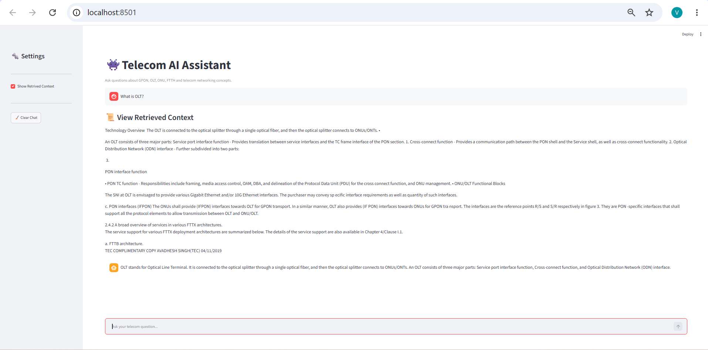

1. Telecom AI Assistant using Retrieval-Augmented Generation (RAG)

A Retrieval-Augmented Generation (RAG) based AI assistant designed to answer telecom-related questions using domain-specific documentation. The application retrieves relevant information from indexed telecom documents and uses a Large Language Model (LLM) to generate context-aware, accurate responses.

Built using **Python**, **LangChain**, **ChromaDB**, **Hugging Face Embeddings**, **Groq Llama 3.3 70B**, and **Streamlit**.

2. Table of Contents

- Overview
- Features
- System Architecture
- Technology Stack
- Project Structure
- Workflow
- Installation
- Usage
- Sample Questions
- Application Preview
- Future Enhancements
- Author

3. Overview

Traditional LLMs generate responses based on their pre-trained knowledge, which may not always include organization-specific or domain-specific information.

This project implements a **Retrieval-Augmented Generation (RAG)** pipeline that retrieves the most relevant information from telecom documents before generating a response. This approach improves response accuracy by grounding the model's output in the retrieved context rather than relying solely on the LLM's internal knowledge.

4. Features

- AI-powered telecom question answering system
- Retrieval-Augmented Generation (RAG) pipeline
- Semantic search using vector embeddings
- Context-aware response generation using Groq Llama 3.3 70B
- Interactive Streamlit chatbot interface
- Efficient document indexing with ChromaDB
- Hugging Face Sentence Transformers for embeddings
- Secure API key management using environment variables
- Optional retrieved context display for debugging and validation

5.  System Architecture

                Telecom PDF Documents
                         │
                         ▼
                 Document Processing
                         │
                         ▼
                   Text Chunking
                         │
                         ▼
            Hugging Face Embeddings
                         │
                         ▼
                    ChromaDB
                 (Vector Database)
                         │
            Similarity Search (Top-K)
                         │
                         ▼
         Retrieved Context + User Query
                         │
                         ▼
             Groq Llama 3.3 70B Model
                         │
                         ▼
                 AI Generated Response
                         │
                         ▼
              Streamlit Chat Interface

6.  Technology Stack

Category & Technologies

Programming Language - Python
Frontend - Streamlit
LLM Framework - LangChain
Vector Database - ChromaDB
Embedding Model - Hugging Face Sentence Transformers
Large Language Model - Groq Llama 3.3 70B
Document Processing - PyPDF
Environment Management - Python Dotenv

7. Project Structure

Telecom-RAG/
│
├── data/
│ ├── gpon_specification.pdf
│ └── gpon_technology.pdf
│
├── utils/
│ └── helper.py
│
├── app.py # Streamlit application
├── ingest.py # Document ingestion and vector indexing
├── rag.py # Retrieval and response generation pipeline
├── config.py # Configuration settings
├── requirements.txt # Project dependencies
├── .env.example # Environment variable template
└── README.md

8.Workflow

### Step 1: Document Ingestion

The telecom PDF documents are loaded and processed.

### Step 2: Text Chunking

Documents are divided into smaller chunks to improve retrieval quality.

### Step 3: Embedding Generation

Each chunk is converted into vector embeddings using Hugging Face Sentence Transformers.

### Step 4: Vector Storage

The embeddings are stored in ChromaDB for semantic similarity search.

### Step 5: User Query

The user submits a telecom-related question through the Streamlit interface.

### Step 6: Similarity Search

The application retrieves the Top-K most relevant document chunks from ChromaDB.

### Step 7: Response Generation

The retrieved context and user query are passed to Groq's Llama 3.3 70B model, which generates a context-aware response.

9. Installation

### Clone the repository

```bash
git clone https://github.com/Varshitha41/telecom-rag-chatbot.git
```

### Navigate to the project directory

```bash
cd telecom-rag-chatbot
```

### Install the required dependencies

```bash
pip install -r requirements.txt
```

### Create a `.env` file

```text
GROQ_API_KEY=your_api_key_here
```

### Run the application

```bash
streamlit run app.py
```

10. Usage

1. Launch the Streamlit application.
1. Enter a telecom-related question.
1. The application retrieves relevant document chunks.
1. The retrieved context is supplied to the LLM.
1. The assistant generates a context-aware response.

1. Sample Questions

- What is GPON?
- Explain the role of an Optical Line Terminal (OLT).
- What is an Optical Network Terminal (ONT)?
- What are the advantages of GPON?
- Explain Passive Optical Networks.
- How does GPON architecture work?

12. Application Preview

## Home Page



---

## Sample Conversation



## Retrieved Context (Optional Debug View)



## Multi-turn Conversation


13. Future Enhancements

- Support for multiple document collections
- Source citations with page references
- Conversation history management
- Hybrid retrieval using keyword and vector search
- Voice-based interaction
- Cloud deployment
- User authentication
- Support for additional LLM providers

14. Author

**Varshitha Chalapaka**
GitHub: https://github.com/Varshitha41

## License

This project is intended for educational and learning purposes.
